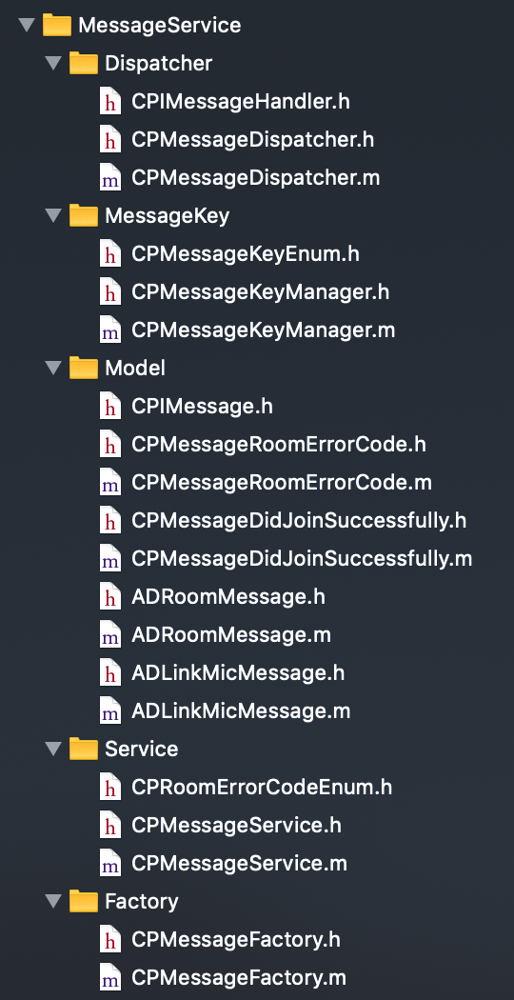

# 长链SDK接入文档

## 集成环境

名称 | 要求
---- | ----
iOS系统版本 | >= 8.0
机器型号 | iPhone 5S及以上
CPU架构支持 | ARMv7、ARMv7s、ARM64
集成工具 | Xcode 11.1及以上版本
bitcode | 关闭


## 使用Cocoapods集成工程

长链SDK是作为静态库引入的。[SDK源码](https://git.huajiao.com/capsules/ios/tree/master/IMSDK/IMServiceLib)

1. 修改Podfile添加如下引用
	
	`pod 'IMService', :git => 'https://git.huajiao.com/capsules/ios.git'`
	
2. 执行 pod install

确保有上面git的访问权限

## SDK主要文件

名称 | 说明
---- | ----
IMServiceLib.h | 1. 创建服务<br/> 2. 返回IMUser<br/> 3. 设置消息回调
IMUser.h | 一个IMUser是一个连接对象可以连接或是断开服务
IMConfigData.h | 配置服务器地址及参数
IMServerAddress.h | 定义服务器地址及端口
IMConstant.h | 错误码及枚举定义
IMNotifyDelegate | 消息回调方法定义
libIMServiceLib.a | 库二进制文件

## SDK使用
1. 引入头文件

	`#import <IMService/IMServiceLib.h>`
	`#import <IMService/IMFeatureChatRoom.h>`


2. 初始化服务器并创建IMUser

	```objc
	NSString *deviceID = [[[UIDevice currentDevice] identifierForVendor] UUIDString];
	// 长链的服务器列表可以有多个
	NSArray<IMServerAddress*> *serverList = @[[IMServerAddress serverAddressWithAddress:@"www.youdomain.com" ports:@[@"443", @"80"]]];
	// dispatcher服务器
	IMServerAddress *dispatcherServer = [IMServerAddress serverAddressWithAddress:@"disp.youdomain.com" ports:@[]];
	
	IMUser *user = [[IMServiceLib sharedInstance] createUser:userID
	                                                    token:token
	                                                 deviceID:deviceID
	                                                    appID:1080
	                                               defalutKey:@"86320c238dbf63bae4af87726060974d"
	                                                  version:102
	                                               serverList:serverList
	                                         dispatcherServer:dispatcherServer
	                                             withDelegate:self]; // 设置消息回调
	                                             
	```
> 注意修改一下配置，跟服务端约定
```
serverAddressWithAddress:@"www.youdomain.com"  长链的服务器列表
serverAddressWithAddress:@"disp.youdomain.com" dispatcher服务器
appID:1080 服务端分配APPID
defalutKey:@"86320c238dbf63bae4af87726060974d" 约定Key
```
3. 启动并登录长链服务器，设置心跳30秒，异步方法

	`BOOL ret = [self.user startWithHB:30];` 

4. 处理登录回调

	```objc
	/**
	 * 状态改变， 用于通知是否登录成功
	 * */
	- (void)onStateChange:(IMUserState)curState From:(IMUserState)fromState User:(IMUser*)user {
	    
	    if (user.configData.appid == app_id) { 
	        switch (curState) {
	            case IM_State_Connected:
	            {
	                break;
	            }
	            case IM_State_Disconnected:
	            {
	                break;
	            }
	            case IM_State_Connecting:
	                break;
	            default:
	                break;
	        }
	    }
	}
	
	```
5. 加入房间，异步方法

	```objc
	// 业务定义的房间ID
	NSString *roomID = @"123456";
	// 自定义参数
	NSDictionary *properties = @{};
	IMErrorCode code = [[[[IMServiceLib sharedInstance] curUser] chatRoomFeatrue] sendJoinChatroom:_roomID withProperties:@{}];
	
	```
6. 退出房间，异步方法

	```objc
	// 业务定义的房间ID
	NSString *roomID = @"123456";
	IMErrorCode code = [[[IMServiceLib sharedInstance] curUser].chatRoomFeatrue sendQuitChatroom:roomID];
	
	```
7. 处理加入、退出房间回调

	```objc
	/**
	 * 加入，退出，查询聊天室的应答事件
	 * eventTyp: 101 -- 查询聊天室，102--加入聊天室， 103--退出聊天室
	 * success: YES --成功， NO -- 失败，如果失败，roominfo为nil
	 * roominfo: 聊天室详情字典包括如下key(:
	 * roomid[NSString]:聊天室id
	 * version[NSNumber(longlong):版本号
	 * memcount[NSNumber(int)]:成员数量(包括qid用户和非qid用户)
	 * regmemcount[NSNumber(int)]:非qid用户数量
	 * members[NSArray]:成员的userid
	 */
	- (void)onChatroomEvent:(int)eventType IsSuccessful:(BOOL)success RoomInfo:(NSDictionary*)roominfo {
	    NSString *roomid =  (roominfo[@"roomid"]);
	    
	    if (eventType == 102) { // 加入聊天室
	        if (success) { // 成功
	          
	        }
	        else// 失败
	        {   
	        
	        }
	    }
	    else if (eventType == 103) { // 退出聊天室
	        if (success) // 成功
	        {   

	        }
	        else // 失败
	        {   
	        
	        }
	    }
	}
	
	```
	
8. 处理消息回调，这里处理收到的各种消息。消息分三种类型：

	+ 点对点的Peer消息
	+ 广播所有设备的公共消息
	+ 加入房间的房间消息
	
	```objc
	/**
	 * 从聊天室系统推送下来的给单个人的消息
	 */
	- (void)onPeerchat:(int64_t)msgid Data:(NSData*)message
	{

	}
	/**
	 * 公共收件箱消息
	 */
	- (void)onPublic:(int64_t)msgid Data:(NSData*)message
	{

	}
	/**
	 * roomid:聊天室id
	 * data: 消息(谈谈服务器发过来的，是个json)
	 */
	- (void)onChatroomData:(NSString*)roomid Sender:(NSString*)userid Data:(NSData*)data MemCount:(int)memcount RegCount:(int)regcount {
	    
	}
	```	


## 推荐接入方法
这里需要指出长链SDK的功能是在连上后接收服务端发送的各种消息，然后怎样把各种消息分发到各个业务模块去处理是要二次开发的。这里推荐一个实现方法，它是基于下面几点：

+ 基于消息分发机制 Message dispatch
+ 消息工厂模式
+ 消息类型管理

相比之前的delegte方法分发消息，这个方法具有以下优点：
 + 解耦
 + 结构清晰
 + 新增消息方便、快捷

具体的实现看下面的Demo

## Demo
[Demo下载地址](https://git.huajiao.com/capsules/ios/tree/master/Demo/aliyunVodDemo)

### 文件列表


	
### 文件介绍
+ Dispatch 消息分发器

	文件 | 描述
	---- | ----
	CPIMessageHandler.h | 接受消息的业务类实现的接受消息的接口
	CPMessageDispatcher.h | 消息分发器

+ MessageKey 定义并管理消息类别
	
	文件 | 描述
	---- | ----
	CPMessageKeyEnum.h | 消息类型定义
	CPMessageKeyManager.h | 管理各种消息类型

+ Model 消息模型

	文件 | 描述
	---- | ----
	CPIMessage.h | 所有的消息模型要实现这个接口
	CPMessageRoomErrorCode.h | 加入房间的错误消息
	CPMessageDidJoinSuccessfully.h | 加入房间的成功消息
	ADRoomMessage.h | 业务的消息基类，实现CPIMessage
	ADLinkMicMessage.h | 业务消息，继承于ADRoomMessage
	
+ Service SDK的接入点
	
	文件 | 描述
	---- | ----
	CPRoomErrorCodeEnum.h | 消息的错误码
	CPMessageService.h | 1. 配置长链服务器地址及参数、<br/> 2. 启动建立链接，错误重连机制、<br/> 3. 创建消息并转交分发器
	
+ Factory 创建消息

	文件 | 描述
	---- | ----
	CPMessageFactory.h | 创建消息的工厂类

### 使用Demo到自己工程
如果要在别的工程使用这套消息分发实现可以按照下面步骤完成

1. 拷贝MessageService文件夹到工程
2. 修改CPMessageService中的服务器地址及参数
4. AppDelegate的didFinishLaunching中添加下面代码启动长链服务

	`[[CPMessageService sharedInstance] checkToStartService]`
	
5. 根据服务器返回消息结构在CPMessageKeyEnum中定义消息类型的key
6. 继承于CPIMessage创建业务消息模型
7. CPMessageFactory中创建消息实体
8. 在要接收消息的业务类中注册要接收的消息，房间消息要先加入房间，

	```
	[[CPMessageService sharedInstance] joinRoom:self.feedInfo.liveID];
	[[CPMessageService sharedInstance] addHandler:self messageKeysArray:[CPMessageKeyManager theKeys]];
    
	```
9. 业务类中实现CPIMessageHandler接收消息

	```
	- (void)handleMessage:(id<CPIMessage>)message
	{
		// 处理消息
		...
	}
	```

10. 业务类中取消注册，加过房间的要退出房间

	```
	[[CPMessageService sharedInstance] removeHandlerForAllKeys:self];
	[[CPMessageService sharedInstance] quitRoom:self.feedInfo.liveID];
    
	```
	
更具体的实现可以参见Demo源码

